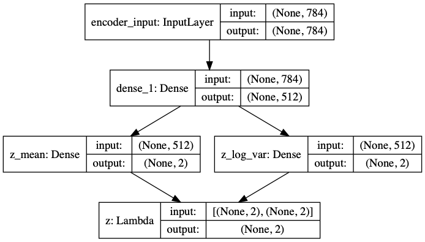
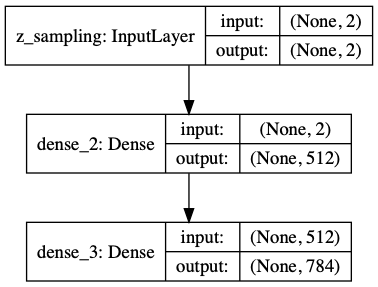
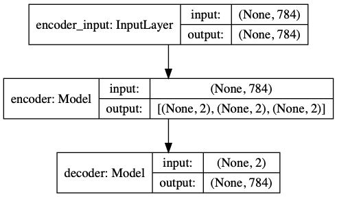
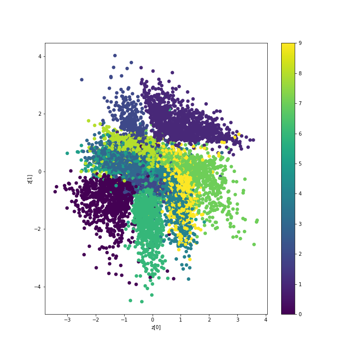
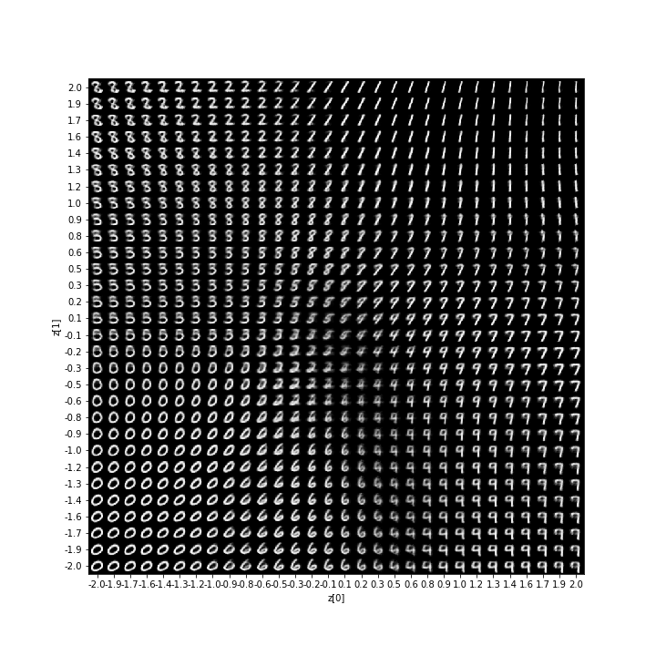

# vae-keras
 Variational Auto Encoders using Keras for clustering

taken from:
https://github.com/keras-team/keras/blob/master/examples/variational_autoencoder.py

## encoder

## decoder

## vae

### digit classes over mean

### digits over latent space

